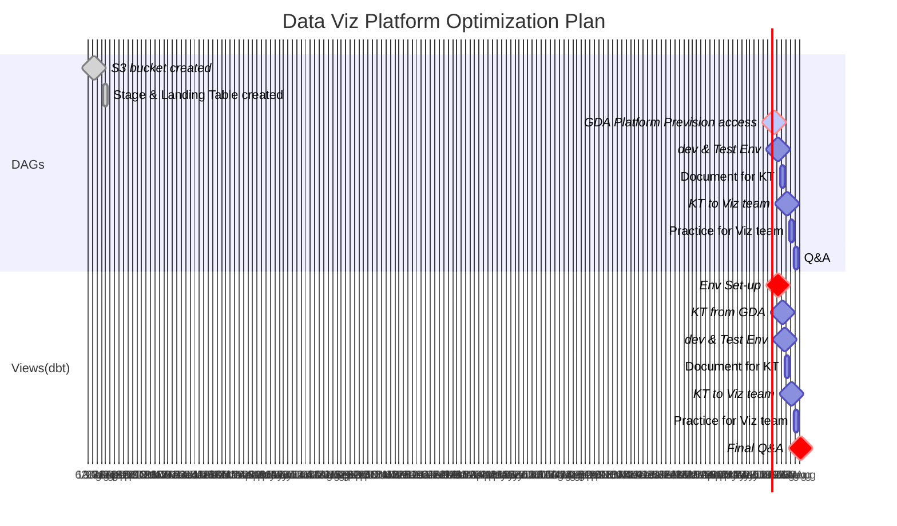

# plan

```mermaid
gantt
    dateFormat  YYYY-MM-DD
    title       Data Viz Platform Optimization Plan
    axisFormat %e%b
    todayMarker on
    %%excludes    weekends
    tickInterval 1week
    %% (`excludes` accepts specific dates in YYYY-MM-DD format, days of the week ("sunday") or "weekends", but not the word "weekdays".)


    section A ridiculously <br> long section <br> name

    section DAGs
    S3 bucket created: milestone, done, des09, 2023-08-01, 2023-08-30
    Stage & Landing Table created      : done, desc10, after des09,1w
    GDA Platform Prevision access    : milestone,active,crit,   des11, after des10, 1w
    dev & Test Env              :    milestone,des12, after des11, 1w
    Document for KT             :    des13, after des12, 1w
    KT to Viz team              :    milestone,des14, after des13, 1w
    Practice for Viz team       :    des15, after des14, 1w
    Q&A                         :    des16, after des15, 1w

    section Views(dbt)
    Env Set-up                  :    milestone,crit, des41, after des11, 1w
    KT from GDA                 :    milestone, des42, after des41, 1w
    dev & Test Env              :    milestone, des43, after des42,des13 1w
    Document for KT             :    des44, after des43, 1w
    KT to Viz team              :    milestone,des45, after des44, 1w
    Practice for Viz team       :    des46, after des45, 1w
    Final Q&A                         :    milestone,crit, des47, after des46, 1w


```

